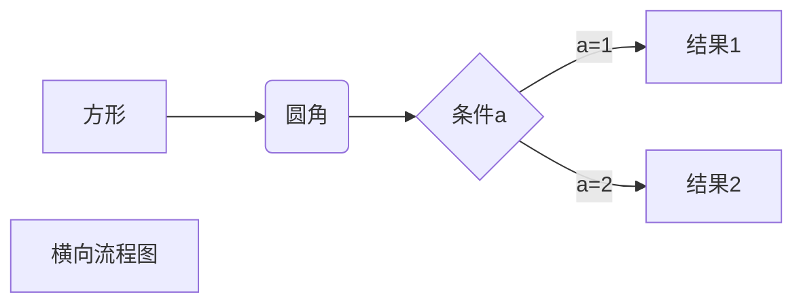
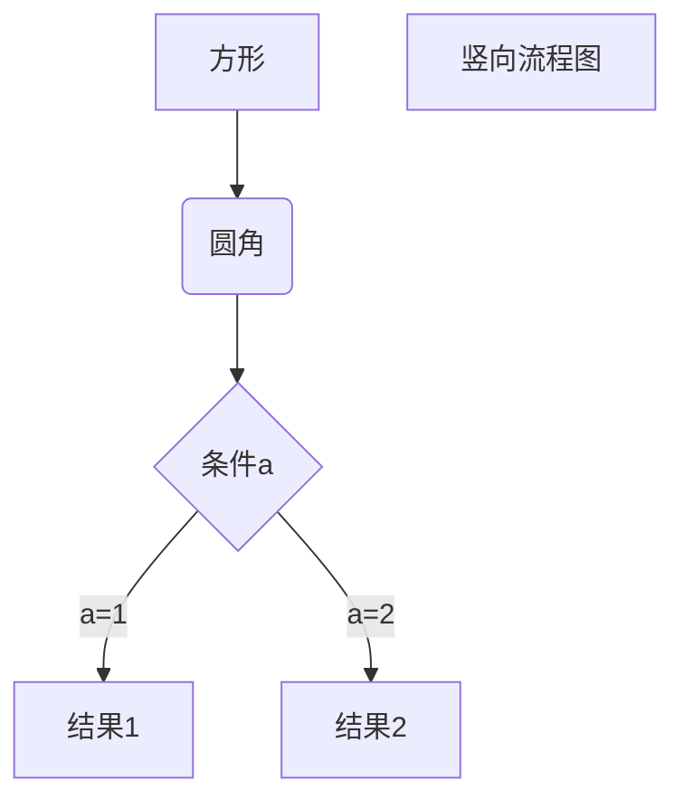
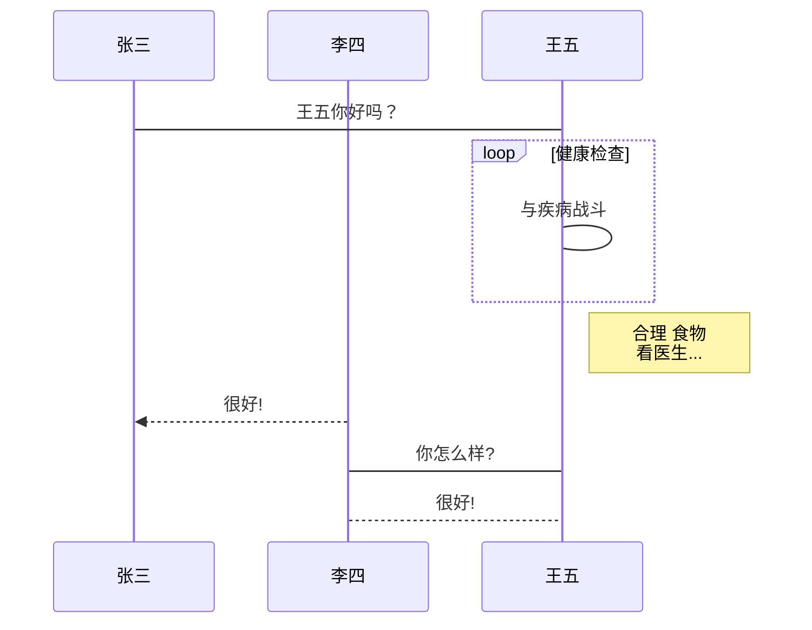

# Markdown语法大全


# Markdown语法教程


###  空格

连续空格类似于单行换行符，大多数Markdown引擎都会忽略它们。

默认情况下，Typora将**在编辑视图中保留连续的空格，并在打印或导出时将其忽略。**您可以在首选项面板中更改此选项。

如果您确实想插入其他Markdpwn引擎支持的连续空格，则可以

- 转义空格，`\`在每个空格之前输入
- 使用HTML实体` &nbsp;`


###  折叠框

示例：

```
<details>
  <summary>折叠框标题</summary>
  折叠框内容
</details>
```


**换行**

Markdown提供了插入单个强行换行符的方法：

- 插入两个空格和一个换行符。
- `<br/>`直接插入HTML标签。

几乎所有Markdown引擎都会将其解析为输出中的强行换行。

**段落**

在Markdown中，**两个换行符**表示创建一个新段落，在Typora中，当您`Enter`按键时，将创建一个新段落，并且如果切换到源代码模式，则会插入两个换行符。


# 标题


标题支持使用两种标记：**底线（-/=）**和**左侧#**

底线（-/=）方式（**不推荐**）：
语法说明如下。
1）底线是=表示一级标题。
2）底线是-表示二级标题。
3）底线符号的数量至少2个。
4）这种语法只支持这两级标题。

``` md
一级标题
=========

二级标题
---------
```


一级标题
=========

二级标题
---------


#方式（**推荐**）
语法说明如下。
1）在行首插入#可标记出标题。
2）#的个数表示了标题的等级。
3）建议在#后加一个空格。
4）Markdown中最多只支持前六级标题。

``` md
# 一级标题
## 二级标题
### 三级标题
#### 四级标题
##### 五级标题
###### 六级标题
####### 七级标题（不支持）
```

# 一级标题
## 二级标题
### 三级标题
#### 四级标题
##### 五级标题
###### 六级标题

####### 七级标题（不支持）


# 段落


1）**段落内换行**，在结尾使用两个及以上空格加回车。


``` md

我就是一段普通的文字。

这段文字需要段内换行，这后面是两个空格  
这一句话是跟上面属于同一段落。

这段文字需要段内换行，这后面是html的换行标签<br/>这一句话是跟上面属于同一段落。

```


我就是一段普通的文字。


这段文字需要段内换行，这后面是两个空格  
这一句话是跟上面属于同一段落。


这段文字需要段内换行，这后面是html的换行标签<br/>这一句话是跟上面属于同一段落。


2）**重新开始一个段落**是段落后面使用一个空行来表示。

**注意：Typora默认是回车就会新起一个段落。**


``` md

我就是一段普通的文字。

我也是一段普通的文字。

```


我就是一段普通的文字。


我也是一段普通的文字。


# 粗体斜体删除线


``` md
粗体由两个*或两个_包裹，斜体由1个*或1个_包裹。
建议粗体使用2个*包裹，斜体使用1个*包裹，因为*比较常见，而且比_可读性更强。
删除线由两个~包裹。
```

| 语法                       | 效果                     |
| -------------------------- | ------------------------ |
| `**粗体**`                 | **粗体**                 |
| `*斜体*`                   | *斜体*                   |
| `~~删除线~~`               | ~~删除线~~               |
| `***斜粗体***`             | ***斜粗体***             |
| `**~~粗体删除线~~**`       | **~~粗体删除线~~**       |
| `*~~斜体删除线~~*`         | *~~斜体删除线~~*         |
| `***~~粗体斜体删除线~~***` | ***~~粗体斜体删除线~~*** |


# 下划线


``` md
<u>下划线</u>
```

<u>下划线</u>


# 注释


``` md
<!--注释-->
```

<!--注释-->


# 分割线


分隔线由3个以上的*/-/_来标记。

``` md
线上面文字

***

线上面文字

---

线上面文字

___

```

语法说明如下。
1）分隔线须使用至少3个以上的*/-/_来标记。
2）行内不能有其他的字符。
3）可以在标记符中间加上空格。
4）上下最好都留一个空行。


线上面文字

***

线上面文字

---

线上面文字

___


# 脚注


在需要添加注脚的文字后加上脚注名字`[^脚注名字]`,称为加注。 然后在文本的任意位置(一般在最后)添加脚注，脚注前必须有对应的脚注名字。

脚注与脚注之间尽量空一行。

``` md
使用 Markdown[^1]可以效率的书写文档, 直接转换成 HTML[^2], 你可以使用 Leanote[^Le] 编辑器进行书写。

[^1]: Markdown是一种纯文本标记语言

[^2]: HyperText Markup Language 超文本标记语言

[^Le]: 开源笔记平台，支持Markdown和笔记直接发为博文
```

使用 Markdown[^1]可以效率的书写文档, 直接转换成 HTML[^2], 你可以使用 Leanote[^Le] 编辑器进行书写。

[^1]: Markdown是一种纯文本标记语言

[^2]: HyperText Markup Language 超文本标记语言

[^Le]: 开源笔记平台，支持Markdown和笔记直接发为博文


# 列表


支持使用有序列表和无序列表，有序列表用数字序号+英文句号+空格+列表内容来标记，无序列表由*/+/-+空格+列表内容来标记。


## 有序列表


有序列表的语法如下。

数字 + . + 空格 + 列表内容

``` md
1. 列表内容
2. 列表内容
3. 列表内容
```

1. 列表内容
2. 列表内容
3. 列表内容


## 无序列表


无序列表的语法如下。

*/+/- + 空格 + 列表内容， 使用 */+/-来标记无序列表的效果是相同的。

推荐使用-。

``` md
* 使用【*】无序列表
* 使用【*】无序列表
* 使用【*】无序列表

+ 使用【+】无序列表
+ 使用【+】无序列表
+ 使用【+】无序列表

- 使用【-】无序列表
- 使用【-】无序列表
- 使用【-】无序列表
```

* 使用【*】无序列表

* 使用【*】无序列表

* 使用【*】无序列表

  

+ 使用【+】无序列表

+ 使用【+】无序列表

+ 使用【+】无序列表

  

- 使用【-】无序列表
- 使用【-】无序列表
- 使用【-】无序列表


## 任务列表


任务列表的语法如下。

``` md
- [ ] 未勾选
- [x] 已勾选
```

任务列表的语法如下。
1）任务列表以-+空格开头，由 [空格/x] 组成。
2）x可以小写，也可以大写，有些编辑器可能不支持大写，所以为避免解析错误，推荐使用小写x。
3）当方括号中的字符为空格时，复选框是未选中状态，为x时是选中状态。

``` md
今日工作：
- [x] 吃
- [x] 喝
- [ ] 玩

明日计划：
- [ ] 吃
	- [x] 吃鱼
	- [ ] 吃瓜
- [ ] 玩
- [x] 睡
```

今日工作：
- [x] 吃
- [x] 喝
- [ ] 玩

明日计划：
- [ ] 吃
	- [x] 吃鱼
	- [ ] 吃瓜
- [ ] 玩
- [x] 睡


# 引用


引用由> 引用内容来标记

``` md
> 引用内容分
```

语法说明如下。
1）多行引用也可以在每一行的开头都插入>。
2）在引用中可以嵌套引用。
3）在引用中可以使用其他的Markdown语法。
4）段落与换行的格式在引用中也是适用的。

``` md
> 我是引用的句子。

> 这是多行引用的第一行，我的最后有两个空格  
我是第二行。

> 这是多行引用的第一行
	第二行，第二行前面有1个TAB

> 引用中可以嵌套引用
>> 我是引用中嵌套引用

> 引用中使用其他 Markdown 标记[百度](https://baidu.com)
    第二行，**加粗**和*斜体*也是支持的，第二行前面有4个空格
```

> 我是引用的句子。


> 这是多行引用的第一行，我的最后有两个空格  
> 我是第二行。


> 这是多行引用的第一行
> 第二行，第二行前面有1个TAB


> 引用中可以嵌套引用
>
> > 我是引用中嵌套引用


> 引用中使用其他 Markdown 标记[百度](https://baidu.com)
> 第二行，**加粗**和*斜体*也是支持的，第二行前面有4个空格


# 图片


插入图片的语法如下。

``` md

```

语法说明如下。
1）alt在图片无法显示时显示的文字,title是鼠标放上去提示文字，都可以为空。
2）图片地址可以是本地图片的路径也可以是网络图片的地址。
3）本地图片支持相对路径和绝对路径两种方式。

``` md

```


# 链接


## 文字链接


文字链接就是把链接地址直接写在文本中。语法是用方括号包裹链接文字，后面紧跟着括号包裹的链接地址，如下所示。

``` md
[link](/uri "title")
```

``` md
[百度](https://baidu.com "百度一下，你就知道")
```

[百度](https://baidu.com "百度一下，你就知道")


## 引用链接


引用链接是把链接地址作为**变量**先在Markdown文件的页尾定义好，然后在正文中进行引用。其语法如下。

``` md
[link][link reference]

[link reference]: /uri "title"
```

``` md
[百度][baidu]
[baidu]: https://baidu.com "百度一下，你就知道"
```

[百度][baidu]

[baidu]: https://baidu.com "百度一下，你就知道"


## 网址链接


将网络地址或邮箱地址使用<>包裹起来会被自动转换为超链接。其语法如下。

``` md
<URL或邮箱地址>
```

``` md
<https://baidu.com>

<liudehua@162.com>
```

<https://baidu.com>

<liudehua@162.com>


# 锚点


网页中，锚点其实就是页内超链接，也就是链接本文档内部的某些元素，实现当前页面中的跳转。

``` md
[锚点描述](#锚点名)
```

``` md
[回到标题](#标题)
```

[回到标题](#标题)


# 代码


## 行内代码


行内代码引用使用`包裹，语法如下。

``` md
`代码`
```

``` md
使用`cd ..`命令切换到上一级目录
```

使用`cd ..`命令切换到上一级目录


## 代码块


代码块以Tab键或4个空格开头，语法如下。

``` md
以TAB键开头：
	def print():
	pass
	
或者以4个空格开头：
    def print():
    pass
```

以TAB键开头：

	def print():
	pass

或者以4个空格开头：

    def print():
    pass


## 围栏代码块


在基础语法中，代码块使用Tab键或4个空格开头；在扩展语法中，围栏代码块使用连续3个`或3个~包裹，还支持语法高亮，可读性和可维护性更强一些。

围栏代码块语法如下。

``` md
\```无编程语言名称
​```
代码片段
​```

\```有编程语言名称
​``` java
代码片段
​```

\~~~无编程语言名称
~~~
代码片段
~~~

\~~~有编程语言名称
~~~ java
代码片段
~~~
```

语法说明如下。
围栏代码块使用连续3个`或3个~包裹，支持语法高亮并可以加上编程语言的名字。

\```无编程语言名称
```
String name = "Tom";
int age = 18;
```

\```有编程语言名称
``` java
String name = "Tom";
int age = 18;
```

\~~~无编程语言名称
~~~
String name = "Tom";
int age = 18;
~~~

\~~~有编程语言名称
~~~ java
String name = "Tom";
int age = 18;
~~~


# 表格


表格的语法如下。

``` md
|表头1| 表头2 | 表头3|
|---- | ---- | ----|
|内容1 | 内容2 | 内容3|
|内容1 | 内容2 | 内容3|
```

语法说明如下。
1）单元格使用|来分隔，为了阅读更清晰，建议最前和最后都使用|。
2）单元格和|之间的空格会被移除。
3）表头与其他行使用-来分隔。
4）表格对齐格式如下。
		左对齐（默认）	 :-
		右对齐	-:
		居中对齐 	:-:
5）块级元素（代码区块、引用区块）不能插入表格中。

关于创建表格的建议如下。
1）在表格的前、后各空1行。
2）在每一行最前和最后都使用|，每一行中的|要尽量都对齐。
3）不要使用庞大复杂的表格，那样会难以维护和阅读。


``` md
普通表格
| 序号 | 标题 | 网址 |
| --- | ---- | --- |
| 01  | 博客  |https://cnblogs.com|
| 02  | 百度  |https://baidu.com|


对齐表格
| 左对齐 | 居中对齐 | 右对齐 |
| :--- | :----: | ---: |
| 01  | 博客  |https://cnblogs.com|
| 02  | 百度  |https://baidu.com|

表格使用其他标记
| 序号 | 标题 | 网址 |
| --- | ---- | --- |
| **01**  | [博客](https://cnblogs.com)  |https://cnblogs.com|
| *02*  | [百度](https://baidu.com "百度一下，你就知道")  |https://baidu.com|
```

普通表格
| 序号 | 标题 | 网址                |
| ---- | ---- | ------------------- |
| 01   | 博客 | https://cnblogs.com |
| 02   | 百度 | https://baidu.com   |


对齐表格
| 左对齐 | 居中对齐 |              右对齐 |
| :----- | :------: | ------------------: |
| 01     |   博客   | https://cnblogs.com |
| 02     |   百度   |   https://baidu.com |

表格使用其他标记
| 序号   | 标题                                           | 网址                |
| ------ | ---------------------------------------------- | ------------------- |
| **01** | [博客](https://cnblogs.com)                    | https://cnblogs.com |
| *02*   | [百度](https://baidu.com "百度一下，你就知道") | https://baidu.com   |


# 表情符号


| 语法         | 效果       |
| ------------ | ---------- |
| `:smile:`    | :smile:    |
| `:laughing:` | :laughing: |
| `:+1:`       | :+1:       |
| `:-1:`       | :-1:       |
| `:clap:`     | :clap:     |

更多的表情符号请参考http://www.webpagefx.com/tools/emoji-cheat-sheet/。


# 高亮上标下标


**github不支持**

**Typora默认未开启，需要在文件>偏好设置>Markdown>勾选Markdown扩展语法才能支持，请谨慎使用这几个语法。**


==高亮== `==高亮==`

内容^上标^ `内容^上标^`

内容~下标~ `内容~下标~`


# 转义


当我们想在Markdown文件中插入一些标记符号，但又不想让这些符号被渲染时，可以使用\进行转义，语法如下。

``` md
\特殊符号
```

可被转义的特殊符号如下。

| 特殊符号 | 说明     |
| -------- | -------- |
| \\       | 反斜杠   |
| \`       | 反引号   |
| \*       | 星号     |
| \_       | 底线     |
| \{}      | 花括号   |
| \[]      | 方括号   |
| \()      | 括弧     |
| \#       | 井字号   |
| \+       | 加号     |
| \-       | 减号     |
| \.       | 英文句号 |
| \!       | 感叹号   |


 # 目录


**github**

语法说明如下。
1）TOC是Table of Contents的缩写。
2）在想插入目录的位置输入[TOC]，按回车键后就可以自动生成文章的目录了。
直接输入[TOC]标记已经很简便了，可如果我们忘记了语法，也可以执行：菜单栏→【段落】→【内容目录】。
效果如下图所示。

``` md
[TOC]
```


[TOC]


#  LaTeX公式（了解）


**GFM不支持**

**Typora默认未开启，需要在文件>偏好设置>Markdown>勾选Markdown扩展语法才能支持。**


> LaTeX 是一种基于 TeX 的排版系统，由于它易于快速生成复杂表格和数学公式，非常适用于生成高印刷质量的科技和数学类文档。如果你常阅读数学、计算机等领域的学术论文，你一定对 LaTeX 不陌生。


## 行内公式


语法是使用$把数学公式包裹起来，如下所示。

``` md
$数学公式$
```

``` md
分数： $ f(x,y) = \frac{x^2}{y^3} $

开根号： $ f(x,y) = \sqrt[n]{{x^2}{^3}} $

省略号： $ f(x_1, x_2, \ldots, x_n) = x_1 + x_2 + \cdots + x_n $
```

分数： $ f(x,y) = \frac{x^2}{y^3} $

开根号： $ f(x,y) = \sqrt[n]{{x^2}{^3}} $

省略号： $ f(x_1, x_2, \ldots, x_n) = x_1 + x_2 + \cdots + x_n $


## 块间公式


语法是使用两个$包裹数学公式，如下所示。

``` md
$$
数学公式
$$
```

``` md
$$
{matrix}
1&0&0\\
0&1&0\\
0&0&1\\
\end{matrix}
$$
```

$$
\begin{bmatrix}
{a_{11}}&{a_{12}}&{\cdots}&{a_{1n}}\\
{a_{21}}&{a_{22}}&{\cdots}&{a_{2n}}\\
{\vdots}&{\vdots}&{\ddots}&{\vdots}\\
{a_{m1}}&{a_{m2}}&{\cdots}&{a_{mn}}\\
\end{bmatrix}
$$

``` md
$$
\mathbf{V}_1 \times \mathbf{V}_2 =  \begin{vmatrix} 
\mathbf{i} & \mathbf{j} & \mathbf{k} \\
\frac{\partial X}{\partial u} &  \frac{\partial Y}{\partial u} & 0 \\
\frac{\partial X}{\partial v} &  \frac{\partial Y}{\partial v} & 0 \\
\end{vmatrix}
${$tep1}{\style{visibility:hidden}{(x+1)(x+1)}}
$$
```

$$
\mathbf{V}_1 \times \mathbf{V}_2 =  \begin{vmatrix} 
\mathbf{i} & \mathbf{j} & \mathbf{k} \\
\frac{\partial X}{\partial u} &  \frac{\partial Y}{\partial u} & 0 \\
\frac{\partial X}{\partial v} &  \frac{\partial Y}{\partial v} & 0 \\
\end{vmatrix}
${$tep1}{\style{visibility:hidden}{(x+1)(x+1)}}
$$


更多的LaTeX数学公式请参考https://www.luogu.com.cn/blog/IowaBattleship/latex-gong-shi-tai-quan。


# 图表（了解）


## 横向流程图


``` md
​```mermaid
graph LR
A[方形] -->B(圆角)
    B --> C{条件a}
    C -->|a=1| D[结果1]
    C -->|a=2| E[结果2]
    F[横向流程图]
​```
```




## 竖向流程图


``` md
​```mermaid
graph TD
A[方形] --> B(圆角)
    B --> C{条件a}
    C --> |a=1| D[结果1]
    C --> |a=2| E[结果2]
    F[竖向流程图]
​```
```




## 横向标准流程图


``` md
​```flow
st=>start: 开始框
op=>operation: 处理框
cond=>condition: 判断框(是或否?)
sub1=>subroutine: 子流程
io=>inputoutput: 输入输出框
e=>end: 结束框
st->op->cond
cond(yes)->io->e
cond(no)->sub1(right)->op
​```
```

```flow
st=>start: 开始框
op=>operation: 处理框
cond=>condition: 判断框(是或否?)
sub1=>subroutine: 子流程
io=>inputoutput: 输入输出框
e=>end: 结束框
st->op->cond
cond(yes)->io->e
cond(no)->sub1(right)->op
```


## 竖向标准流程图


``` md
​```flow
st=>start: 开始框
op=>operation: 处理框
cond=>condition: 判断框(是或否?)
sub1=>subroutine: 子流程
io=>inputoutput: 输入输出框
e=>end: 结束框
st(right)->op(right)->cond
cond(yes)->io(bottom)->e
cond(no)->sub1(right)->op
​```
```

```flow
st=>start: 开始框
op=>operation: 处理框
cond=>condition: 判断框(是或否?)
sub1=>subroutine: 子流程
io=>inputoutput: 输入输出框
e=>end: 结束框
st(right)->op(right)->cond
cond(yes)->io(bottom)->e
cond(no)->sub1(right)->op
```


## UML时序图


``` md
​```sequence
对象A->对象B: 对象B你好吗?（请求）
Note right of 对象B: 对象B的描述
Note left of 对象A: 对象A的描述(提示)
对象B-->对象A: 我很好(响应)
对象A->对象B: 你真的好吗？
​```
```

```sequence
对象A->对象B: 对象B你好吗?（请求）
Note right of 对象B: 对象B的描述
Note left of 对象A: 对象A的描述(提示)
对象B-->对象A: 我很好(响应)
对象A->对象B: 你真的好吗？
```


## UML时序图源码(复杂)


``` md
​```sequence
Title: 标题：复杂使用
对象A->对象B: 对象B你好吗?（请求）
Note right of 对象B: 对象B的描述
Note left of 对象A: 对象A的描述(提示)
对象B-->对象A: 我很好(响应)
对象B->小三: 你好吗
小三-->>对象A: 对象B找我了
对象A->对象B: 你真的好吗？
Note over 小三,对象B: 我们是朋友
participant C
Note right of C: 没人陪我玩
​```
```

```sequence
Title: 标题：复杂使用
对象A->对象B: 对象B你好吗?（请求）
Note right of 对象B: 对象B的描述
Note left of 对象A: 对象A的描述(提示)
对象B-->对象A: 我很好(响应)
对象B->小三: 你好吗
小三-->>对象A: 对象B找我了
对象A->对象B: 你真的好吗？
Note over 小三,对象B: 我们是朋友
participant C
Note right of C: 没人陪我玩
```


## UML标准时序图


``` md
​```mermaid
%% 时序图例子,-> 直线，-->虚线，->>实线箭头
  sequenceDiagram
    participant 张三
    participant 李四
    张三->王五: 王五你好吗？
    loop 健康检查
        王五->王五: 与疾病战斗
    end
    Note right of 王五: 合理 食物 <br/>看医生...
    李四-->>张三: 很好!
    王五->李四: 你怎么样?
    李四-->王五: 很好!
​```
```




